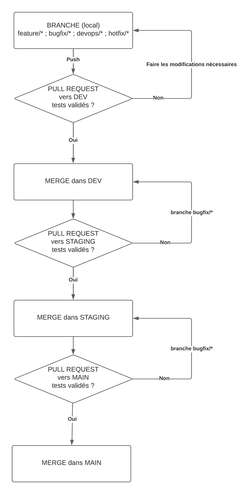

# 🚀 Contribution – Projet PokemonTeam

Bienvenue sur le projet **PokemonTeam** !  
Ce document explique comment contribuer au projet de manière sécurisée, efficace et collaborative.

---

## 🧬 Structure Git – Branches principales

| Branche      | Rôle                                                                 |
|--------------|----------------------------------------------------------------------|
| `main`       | Version stable. Ne jamais développer dessus directement.             |
| `staging`    | Intégration globale. Sert à valider l’interopérabilité des frontends.|
| `dev`        | Développement actif du backend commun (auth, progression, etc.).     |

---

## 🌱 Branches temporaires

| Type              | Convention                   | Exemple                         |
|-------------------|------------------------------|----------------------------------|
| Fonctionnalité    | `feature/nom_fonction`       | `feature/auth`                  |
| Correction de bug | `bugfix/nom_bug`             | `bugfix/login-null-exception`   |
| Patch urgent      | `hotfix/nom_patch`           | `hotfix/fix-prod-login`         |
| DevOps / CI       | `devops/nom_tache`           | `devops/workflow-tests`         |

---

## 🔁 Cycle de contribution

1. **Créer une branche temporaire depuis `dev`** :
   ```bash
   git checkout dev
   git pull origin dev
   git checkout -b feature/ma-fonction

2. **Développer avec des commits clairs** :

```bash
  git commit -m "feature: Implémentation du système de shop"
```

3. **Pousser la branche et créer une pull request vers `dev`.**

4. **CI GitHub se déclenche automatiquement** :
   * 🔧 Compilation .NET
   * 🧪 Exécution des tests unitaires

5. ✅ Si la PR passe, elle est reviewée puis mergée manuellement.

6. 🧹 Après merge, supprimer la branche temporaire :
```bash
   git branch -d feature/ma-fonction
   git push origin --delete feature/ma-fonction
```

---

## 🧪 CI obligatoire

✅ Tout push sur main, staging, dev doit passer par une PR avec build/test réussi.
❌ Aucun push direct sur ces branches n’est autorisé.

## 📦 Bonnes pratiques

* 1 PR = 1 feature ou 1 fix.
* Nom de branche clair.
* Code compilable (pas de dépendances manquantes).
* Tests unitaires si possible (même simples).
* Écrire en anglais ou français cohérent.

---
## 📊 Diagramme de workflow


---
Merci pour votre rigueur et bon code à tous ! 💪